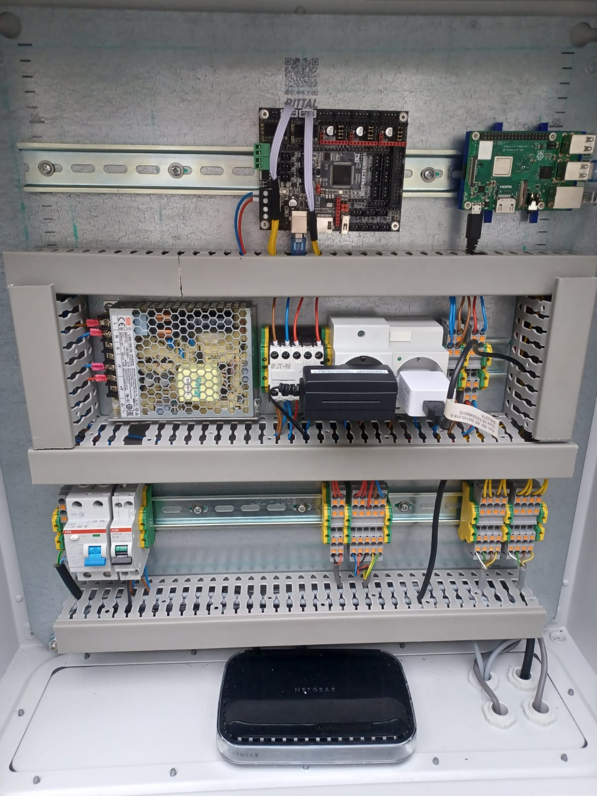

# GreenRobotics

Dit is een schoolproject van 4 gemotiveerde jongens. De opdracht is om een robot te bouwen die een groentetuin zal verbouwen. Dit hebben wij ontwikkeld in de vorm van een enorme 3D printer, welke gemonteerd is op een grote plantenbak. In deze README vind je alle systeem eigenschappen en benodigde informatie voor de software van onze robot.

_GreenRobotics_

## Systeem eigenschappen

### Pagina's

- Home
- Planten
- Camera views
- Settings
- acount beheer

### Home

Op de home pagina vind je algemene systeem info. Denk aan hoeveel spanning het systeem trekt, waar het mee bezig is, in welke staat het zich bevindt, hoelang het systeem draait enzovoort. Hier valt niet veel aan te passen, maar deze pagina is meer informatief.

### Planten

Op de planten pagina kan je zien welke planten er geplant zijn. Je ziet hier de status van iedere plant, maar je kan hier ook groenten planten.

### Camera views

Op de camera pagina vind je de kamerabeelden van het systeem. Niet meer en niet minder, ook dus een pure informatieve pagina om mee te kijken met het systeem.

### Settings

Op de settings pagina vind je meerdere instellingen. Zo kan je het systeem helemaal naar eigen wens instellen. Denk aan de hoeveelheid water nodig is voor planten, hoe vaak hij op onkruid checkt, en noem het maar op.

### Acount beheer

Deze pagina spreekt voor zich, hier kan je je account beheren. Denk aan instellingen zoals je wachtwoord, of het beheren van andere accounts en wat deze mogen doen in het systeem.

## Algemene info

**BELANGRIJK**

Het systeem werkt met bepaalde hardware. Het is een combinatie van deze hardware die het systeem compleet maakt. Er valt natuurlijk het een en ander te veranderen, maar de componenten moeten aan bepaalde eisen voldoen wil het systeem nog optimaal werken. 

_GreenRobotics is niet aansprakelijk voor eventuele schade aan personen of voorwerpen. Ook zijn we niet aansprakelijk betreft niet werkende systemen die niet door GreenRobotics zelf zijn ontworpen en gecreëerd_

### Hardware

Het systeem bestaat uit verschillende onderdelen. Deze onderdelen zijn globaal omschreven, je bent vrij hierin je eigen product keus te maken.

- Linux computer met minimaal 2 usb poorten en ethernet of WiFi aansluiting _**Advies: Raspberry Pi 4B**_
- Controler board van een 3D printer MET SENSORLESS HOMING _**Advies: BTT SKR 2**_
- Micro controler voor sensoren _**Advies: Arduino Uno**_

_Algemene configuratie van GreenRobotics_

## Updates

| Update Nr. | Persoon | Datum | Opmerking |
| ----------- | ----------- | ----------- | ----------- |
| 1.1 | Sebastiaan | 23-11-2022 | Updated the header of the site with all correct redirections to pages |
| 1.2 | Sebastiaan | 23-11-2022 | Setup to create all user administration pages and updated git and readme for easy documentation |
| 2.1 | Sebastiaan | 25-11-2022 | Created backend system for registrating empty user accounts |
| 2.2 | Sebastiaan | 25-11-2022 | Completed all the backend and frontend of the authenticating system (login and register), now starting to work on the user profile and edditable settings |
| 2.3 | Sebastiaan | 25-11-2022 | Updated some error from auth system and started working on the permissions system for administrating the user system and user permissions |
| 3.1 | Sebastiaan | 28-11-2022 | Fixed some bugs in my spare time |
| 4.1 | Sebastiaan | 02-12-2022 | Auth system updates for rights and guest users, also started at the frontend of the user info and auth setup pages |